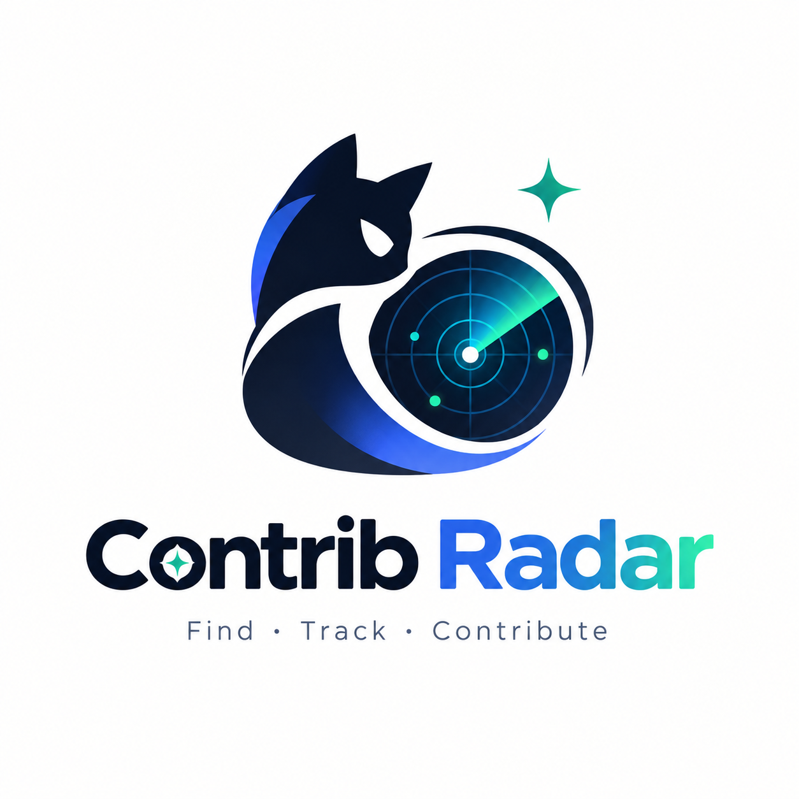

<div align="center">



# Contrib Radar

**Find the right open-source contribution before you write code.**

在写代码之前，锁定真正值得投入的开源贡献机会。用可解释的打分与碰撞检测，从一堆候选项目里筛出「低门槛 + 有人理」的 Issue，一路跟踪到 PR 合并。

[](./LICENSE)
[](https://www.python.org/)
[](./contrib-radar/scripts)
[](https://agentskills.io)
[](https://github.com/louisss1016/contrib-radar/issues)

**[快速开始](#-快速开始) · [它解决什么问题](#-它解决什么问题) · [真实效果](#-真实效果) · [命令参考](#-命令参考) · [工作流程](#-工作流程) · [定时任务自动化](#-定时任务自动化) · [设计原则](#-设计原则) · [FAQ](#-faq)**

</div>

---

## 🎯 它解决什么问题

开源贡献最常见的四个卡点，Contrib Radar 逐一拆掉：

| 卡点 | 表现 | 解决方式 |
|------|------|---------|
| **不知道选哪个项目** | 热门仓库门槛高，冷门仓库怕没响应 | `discover_repos.py` 按方向/语言/规模筛选，`--beginner` 进入 100~1000 star 甜蜜区 |
| **不知道从哪个 Issue 入手** | 海量 Issue 里找不到「低门槛 + 有人理」的；roadmap issue 不打标签容易漏 | `find_issues.py` 双维度启发式打分（0~100），标签零命中自动 fallback 全量 |
| **怕白干** | 提交前才发现已有人认领，或项目禁止 AI 代码 | 撞车检测剔除被 open PR 引用的 Issue + `claim_issue.py` 冲突检查 + AI 政策扫描（去误报） |
| **PR 石沉大海** | 提交后没人跟进、CI 挂了、上游更新没 rebase | `pr_tracker.py` 跟踪 CI / Review / Rebase，自动判断下一步动作 |

**它适合**：想开始做开源贡献的开发者、把开源贡献当面试素材的求职者、想系统化「找项目 → 找切入点 → 实现 → 提交 → 维护」全流程的人、以及想配合定时任务每天自动挖掘贡献机会的人。

**它不适合**（边界声明）：

- 想要「完全无人值守自动提 PR 并躺平」的场景——本工具在**选定 issue 后**和**提交 PR 前**设了两个人工确认点，其余步骤可全自动
- 只想在某一个固定仓库长期深耕——直接用 `find_issues.py` + `claim_issue.py` 就够了
- 需要商业级私有数据或 SLA 保障的团队场景——本项目是零依赖的个人开源工具

---

## 🚀 快速开始

### 1. 安装

把 `contrib-radar/` 文件夹放入 Agent Skills 目录即可，无需 `pip install`：

```bash
git clone https://github.com/louisss1016/contrib-radar.git
```

| 平台 | 目录 |
|------|------|
| Claude Code | `~/.claude/skills/contrib-radar/` |
| Codex（OpenAI） | `~/.codex/skills/contrib-radar/` |
| Cursor | `.cursor/skills/contrib-radar/`（项目级） |
| GitHub Copilot | `.github/skills/contrib-radar/`（项目级） |
| 豆包 Doubao | `~/.doubao/agent_mode/workspace/.skills/contrib-radar/` |
| WorkBuddy 等本地 Agent | `~/.workbuddy/skills/contrib-radar/`（用户级，通用） |
| 其他 Agent Skills 平台 | 按平台约定放入 skills 目录即可 |

### 2. 使用

**对话式**（推荐）：在支持 Agent Skills 的对话里直接说——

> 帮我找一个 TypeScript 写的 AI Agent 方向、star 100~1000 的开源项目，顺便看看有哪些适合新手的 Issue。

**命令行**：也可以把它当纯 CLI 工具用：

```bash
cd contrib-radar/scripts

python discover_repos.py --topic ai-agent --language typescript --beginner   # ① 发现候选
python repo_health.py <owner/repo>                                           # ② 健康体检 + AI 政策
python find_issues.py <owner/repo> --min-score 40                            # ③ 筛选可认领 Issue
python claim_issue.py <owner/repo> <issue_number>                            # ④ 检测认领方式 + 冲突检查
python pr_tracker.py <owner/repo> <pr_number>                                # ⑤ PR 生命周期跟踪
```

每个脚本都支持 `--help` 查看全部参数。

> 💡 **建议设置环境变量 `GITHUB_TOKEN`**：Search 限额从 10/min 提升至 30/min、core 从 60/hr 提升至 5000/hr，并取消节流等待。如果使用已绑定 GitHub MCP/OAuth 的 Agent 平台，则不受未认证限流影响。

---

## ✨ 真实效果

以下为实测输出（数据随查询时间变化，仅示意效果）：

<details>
<summary><b>① 发现候选项目</b>（TS 生态 · 新手甜蜜区）</summary>

```text
$ python discover_repos.py --topic vercel-ai-sdk --language typescript --beginner --limit 3
查询: topic:vercel-ai-sdk stars:100..1000 pushed:>=2026-06-13 archived:false fork:false language:typescript
命中 10 个仓库，按最近更新取前 3 个:

1. zoonk/zoonk  ⭐150  [TypeScript]  0天前推送
   Turn any topic into clear, structured lessons
   https://github.com/zoonk/zoonk

2. vargHQ/sdk  ⭐337  [TypeScript]  1天前推送
   AI video generation SDK — JSX for videos. One API for Kling, Flux, ElevenLabs, Veed.
   https://github.com/vargHQ/sdk

3. jagreehal/ai-sdk-ollama  ⭐132  [TypeScript]  1天前推送
   A Vercel AI SDK provider for Ollama built on the official ollama package.
   https://github.com/jagreehal/ai-sdk-ollama
```
</details>

<details>
<summary><b>② 健康体检 + AI 政策检查</b>（12 项指标红绿灯）</summary>

```text
$ python repo_health.py pydantic/pydantic --json
仓库: pydantic/pydantic  ⭐ 28756  🍴 2937
主语言: Python  |  https://github.com/pydantic/pydantic
  🟢 最近提交: 0 天前
  🟢 Issue 关闭率 (closed/open): 5195/540 = 9.62
  🟢 近 30 天合并 PR 数: 67
  🟢 最近 Release: 13 天前
  🟢 贡献指南: 有
  🟢 开源 License: MIT
健康度: 12/12  →  🟢 健康，适合投入
AI 政策: mention — 命中 CONTRIBUTING.md: ['ai generated']（有 AI 相关表述，需人工确认口径）
```
</details>

<details>
<summary><b>③ Issue 筛选 + 双维度打分 + Stack Match + Why this issue?</b></summary>

```text
$ python find_issues.py helsome/folio --stack python,langchain,fastapi --limit 3
[信息] 标签搜索零命中，自动 fallback 到全量 open issue 列表...
仓库: helsome/folio  条件: open / 无assignee / 近60天活跃 / 标签 ['good first issue', 'help wanted'] | 技术栈: python,langchain,fastapi
碰撞检测: 扫描 12 个 open PR 引用，隐藏 2 个高碰撞风险 Issue

[ 84/100] #25  [Finance Data] Add provider routing, rate-limit handling, cache, and failover
   标签: - | 2天前活跃 | 评论 0 | milestone: Finance Data v0.5 | https://github.com/helsome/folio/issues/25
   Issue Quality:         86/100  (clarity28/30, label0/15, freshness20/25, milestone15/20, discussion5/10)
   Feasibility:           82/100  (collision30/30, scope17/25, beginner10/25, stack15/20)
   Stack Match:           ████████████████░░░░  75%  (python ✓ | langchain ✓ | fastapi —)
   Collision Risk:        🟢 LOW — No open PR, no assignee, low comment activity
   🎯 Why this issue?
     ✓ Clear description with reproduction steps
     ✓ On project roadmap (milestone: Finance Data v0.5)
     ✓ Recently active (2 days ago) — maintainer is engaged
     ✓ No active collision — no open PR, no assignee
     ✓ Strong stack match (75%): python, langchain
     ⚠ No beginner-friendly label (may be a roadmap issue requiring more context)
     ⚠ No comments yet — be the first to engage

💡 2 个高碰撞风险 Issue 已隐藏，加 --show-collision 查看详情
```
</details>

<details>
<summary><b>④ 认领方式检测 + 冲突检查</b></summary>

```text
$ python claim_issue.py helsome/folio 25
仓库: helsome/folio  Issue: #25
链接: https://github.com/helsome/folio/issues/25

=== Claim Bot 检测 ===
  ✅ 检测到 claim bot: issue-claim.yml (.github/workflows/issue-claim.yml)

=== 认领冲突检查 ===
  ✅ 无认领冲突，可以认领

=== 认领建议 ===
  🤖 通过 bot 认领:
     命令: /claim
     - 在 issue 下发表评论，内容仅为 /claim
     - 发完后不要编辑评论（bot 只在评论 created 时触发，编辑不触发）
     - 等待 bot 回复确认（通常会评论 'Assigned!' 或类似）
```
</details>

<details>
<summary><b>⑤ PR 生命周期跟踪</b>（CI / Review / Rebase / 下一步动作）</summary>

```text
$ python pr_tracker.py helsome/folio 72
仓库: helsome/folio  PR: #72
标题: feat(providers): add provider resilience...

=== 基本状态 ===
  状态: 🟢 open
  Draft: 否
  可合并: True (state: clean)
  最后更新: 2026-09-12T08:00:00Z

=== CI 状态 ===
  总计: 3 | ✅ 3 | ❌ 0 | ⏳ 0 | ⏭️ 0
  状态: success

=== Review 状态 ===
  Reviews: 1 (✅ approved: 1, ❌ changes: 0, 💬 commented: 0)

=== Rebase 检测 ===
  ✅ 无需 rebase（base 分支无新 commit）

=== 下一步动作 ===
  🟢 [low] wait: PR 状态正常，等待维护者合并
```
</details>

---

## 📈 Case Study: From 1,000 Issues → 3 Contributions

> 以下为一次完整扫描的真实漏斗数据（Python + AI Agent 方向，100~1000 star 甜蜜区）。

```
输入: Python + AI Agent, 100~1000 stars
  │
  ▼
发现候选仓库 ........................................... 47
  │  discover_repos.py --language python --beginner
  ▼
健康度筛选 ............................................. 12
  │  repo_health.py 批量体检（AI 政策 + 12 项指标）
  │  剔除: 维护者不活跃 18, AI 政策 blocked 7, 无贡献指南 6, 其他 4
  ▼
Issue 筛选 ............................................. 86
  │  find_issues.py 全量 open issue + 启发式打分
  │  剔除: 有 assignee 142, 超 60 天无活动 201, 低于 min-score 89
  ▼
PR Collision Detection ................................. 31
  │  扫描全部 open PR，剔除被 fixes #N 引用的 issue
  │  剔除: 已被 open PR 引用 55
  ▼
AI Policy Check ........................................ 18
  │  对剩余仓库复核 CONTRIBUTING.md 中的 AI 贡献政策
  │  剔除: AI 政策 blocked 8, mention 但需确认 5
  ▼
Contribution Score (Top 3) .............................. 3 ⭐
```

**最终 Top 3 贡献机会：**

| 排名 | Issue | 分数 | Collision Risk | 关键理由 |
|------|-------|------|----------------|---------|
| 🥇 | `#1423` Add retry logic for rate-limited API calls | **96/100** | 🟢 LOW | ✓ Clear repro · ✓ No assignee · ✓ On milestone · ✓ Recently active |
| 🥈 | `#891` Fix typo in documentation index | **91/100** | 🟢 LOW | ✓ Good first issue · ✓ No active PR · ✓ Small change surface |
| 🥉 | `#721` Add config option for custom timeout | **88/100** | 🟡 MEDIUM | ✓ Help wanted · ⚠ 8 comments — check before claiming |

> 从 47 个候选仓库、数百个 open issue 中，最终锁定 3 个真正值得投入的贡献机会。这就是 Contrib Radar 的核心价值：**在写代码之前，找到对的那个。**

---

## 📖 命令参考

| 命令 | 作用 | 关键参数 |
| --- | --- | --- |
| `discover_repos.py` | 按方向/语言/规模发现候选项目 | `--topic` `--query` `--language` `--stars` `--max-stars` `--pushed-days` `--beginner` `--limit` `--json` |
| `repo_health.py` | 12 项健康度体检 + AI 政策扫描 | 多仓库批量、`--json`（单项缺失自动降级，不中断） |
| `find_issues.py` | Issue 筛选、双维度打分（Quality + Feasibility）、Collision Risk、Stack Match、Why this issue? | `--days` `--labels` `--include-bugs` `--beginner-only` `--limit` `--min-score` `--no-fallback` `--show-collision` `--stack` `--json` |
| `claim_issue.py` | 认领方式检测 + 认领冲突检查 | 接受 `owner/repo N` 或 issue URL、`--json` |
| `pr_tracker.py` | PR 生命周期跟踪 + 下一步动作判断 | 接受 `owner/repo N` 或 PR URL、`--json` |

> 全部脚本支持 `--help`；输出格式（人读表格 / `--json`）可随场景切换。

---

## 🧭 工作流程（Agent 视角）

```
用户提供仓库 URL？
├── 是 → Route B：直接分析该项目的 PR/Issue 切入点
├── 否 + 用户要求每日/定期监控或自动贡献 → Route C / C+
└── 否 → Route A：发现候选项目 → 用户选定一个 → 进入 Route B
```

- **Route A · 从零开始**：收集画像（技术栈先确认 **Python / TypeScript**）→ 发现候选 → 批量健康体检 → 输出候选表 → 用户选定
- **Route B · 已有目标仓库**：项目理解（README/CONTRIBUTING/主入口）→ 机筛 Issue + 人工复核 → AI 政策前置检查 → 7 维架构缺陷分析（定位到具体文件/函数）→ Top 3 贡献建议
- **Route C · 持续监控**：配合定时任务每日执行——跨仓库扫描新出现的 good first issue / help wanted（Python / TypeScript，近 24~48h 更新）→ 撞车复核 → 与上次日报对比 → 输出差异日报 `daily-issue-scan-<date>.md`
- **Route C+ · 自动贡献模式**：状态持久化（`contrib-radar-state.json`）→ 打分筛选 → **人工确认点 1**（选定 issue）→ Baseline 采集 → 认领检测 → 自动实现 → 6 项质量门控（测试零新增失败/typecheck/有测试覆盖/<300行/AI政策/无撞车）→ **人工确认点 2**（提交 PR 前）→ fork/commit/push/create PR → PR 生命周期跟踪（CI/Review/Rebase/跟进）

选定切入点后，可继续走 `references/contribution-workflow.md` 全流程：Baseline 采集 → 认领检测 → 方案设计 → 代码实现 → PR 提交（含可复现测试报告）→ PR 维护（rebase/冲突/review）→ 面试叙事（STAR + 60 秒话术）。

---

## 🏗️ 能力边界：Core Scripts vs Agent Workflow

Contrib Radar 明确区分**脚本能力**（确定性、可复现、零依赖）和**Agent 依赖能力**（需要 LLM 推理或人工确认），避免对自动化产生过高期待。

### Core Scripts（开箱即用，✅ 已实现）

| 能力 | 脚本 | 状态 |
|------|------|------|
| 候选项目发现 | `discover_repos.py` | ✅ |
| 健康度体检 + AI 政策 | `repo_health.py` | ✅ |
| Issue 筛选 + 打分 | `find_issues.py` | ✅ |
| Collision Risk 检测 | `find_issues.py` | ✅ |
| 认领方式检测 + 冲突检查 | `claim_issue.py` | ✅ |
| PR 生命周期跟踪 | `pr_tracker.py` | ✅ |
| `--json` 结构化输出 | 全部脚本 | ✅ |

### Agent Workflow（依赖 Agent 能力或人工确认）

| 能力 | 依赖 | 状态 |
|------|------|------|
| 项目理解与架构分析 | Agent 读 README/源码 | ✅ 方法论在 `references/` |
| 贡献方案设计 | Agent 推理 | ✅ 方法论在 `references/` |
| 代码实现 | Agent 写代码 | 🤖 Agent-dependent |
| 测试编写与运行 | Agent + 本地环境 | 🤖 Agent-dependent |
| PR 提交（fork/push/create） | GitHub MCP/OAuth + 人工确认 | 🔒 Human confirmation required |
| PR Review 回应 | Agent 推理 + 人工确认 | 🤖 Agent-dependent |

> **设计原则**：Core Scripts 做「筛选和决策支持」，Agent 做「理解和实现」，人工确认点做「安全闸门」。三者各司其职，不越界。

---

## ⏰ 定时任务自动化（Route C+）

> 与上方「快速开始」的**手动对话触发**不同，本章节的 Query 模板专为**定时任务自动触发**设计——包含完整的状态持久化、质量门控和人工确认点，适合每天自动运行。两种场景互补，不冲突。

在支持 cron 的 Agent 平台（如豆包）创建每日定时任务，触发后自动执行 Route C+ 全流程：扫描项目 → 筛选 Issue → 认领 → 实现 → 质量门控 → 人工确认 → 提交 PR → 跟踪 PR 生命周期。

### 快速配置

1. 创建一个每天执行的定时任务（建议早上 8:00，cron `0 8 * * *`）
2. 将下方的 **Query 模板** 复制到任务的 query 字段
3. 根据你的技术栈和偏好修改 `【用户画像】` 部分
4. 确保 GitHub MCP/OAuth 已绑定（用于 fork / push / 创建 PR）

### Query 模板（可直接复制）

```text
本次请求是由「每日开源贡献自动扫描」定时任务到时触发的。

请执行 contrib-radar skill 的 Route C+ 自动贡献模式。

【Skill 位置】
<把 contrib-radar 目录的绝对路径填在这里，如 ~/.doubao/agent_mode/workspace/.skills/contrib-radar/>
先读取该目录下的 SKILL.md，严格按其 Route C+ 规范执行。

【用户画像】
- 技术栈：Python（LangChain / PydanticAI / OpenAI SDK）、TypeScript（React / Node / Electron / Bun）
- 兴趣方向：AI Agent、AI 应用开发、LLMOps、开发者工具
- 时间预算：单个 PR 控制在 300 行以内，1~2 天可完成
- GitHub 账号：<你的 GitHub 用户名>
- 偏好：commit message 用中文，PR 标题用英文

【每日执行流程】
1. 读取当前工作目录的 contrib-radar-state.json，恢复上次进度（已扫描 issue、活跃 PR、黑名单、冷却期）
2. 项目发现：运行 scripts/discover_repos.py，分别用 --language typescript --beginner 和 --language python --beginner，各取 top 5
3. 健康度筛查：对候选批量运行 scripts/repo_health.py，过滤 AI 政策 blocked 和健康度 < 50% 的
4. Issue 筛选：对通过筛查的仓库运行 scripts/find_issues.py --min-score 50，取打分最高的 3 个
5. 认领冲突检查：对 top 候选运行 scripts/claim_issue.py，排除 assignee/认领评论/PR 引用冲突
6. PR 跟踪：对状态文件中所有 active_prs 运行 scripts/pr_tracker.py，按 next_actions 自动处理（CI 失败则尝试修复、上游更新则 rebase、超 7 天无回应则礼貌跟进），更新状态

【自动实现（每天最多 1 个新 PR）】
- 从通过筛选的候选中选打分最高、预估改动最小的 1 个 issue（排除已在状态文件中的）
- 【人工确认点 1】向用户展示：issue 标题/链接/打分/预估工作量/2~3 句实现方案，等待用户回复"确认"后才开始写代码
- 实现流程：clone 仓库 → baseline 采集（先跑全量测试记录预先存在的失败）→ 认领（bot /claim 发完不要编辑）→ 按 references/contribution-workflow.md 逐步实现 → 补测试
- 质量门控（全部通过才进入提交）：① 原有测试零新增失败 ② typecheck/lint 通过 ③ 新增代码有测试覆盖 ④ 改动 < 300 行 ⑤ AI 政策非 blocked ⑥ 提交前复核无撞车
- 【人工确认点 2】向用户展示：改动文件清单 + 可复现测试报告（环境/命令/pass-fail 数量/baseline 对比）+ PR 描述草稿，等待用户回复"确认提交"后才执行 GitHub 写操作
- 提交：fork（如未 fork）→ 创建 feat/<issue>-<desc> 分支 → Conventional Commits 拆分 2~4 个 commit → push → 创建 PR（标题英文、body 含可复现测试报告、Closes #N）
- 更新状态文件：标记该 issue 为 pr_submitted，PR 加入 active_prs

【输出要求】
- 每日扫描日报写入 daily-issue-scan-<YYYY-MM-DD>.md：今日新增候选、筛选结果、活跃 PR 状态变化
- 到达人工确认点时，明确提示"需要你确认后才能继续"，不要自行跳过
- 没有合适候选或全部在冷却期时，说明原因并列出被排除的仓库及理由
- 状态持久化到 contrib-radar-state.json，下次运行时读取
- 所有操作在当前工作目录下执行，项目 clone 到子目录
```

### 配置说明

| 配置项 | 说明 | 建议值 |
|--------|------|--------|
| 执行时间 | 每天触发时间，建议你起床后、有时间处理人工确认点时 | 每天 08:00（cron `0 8 * * *`） |
| Skill 位置 | contrib-radar 目录的绝对路径，定时任务触发时 agent 需要能找到 | 安装到全局 skills 目录后可省略此行 |
| 技术栈 | 决定 discover_repos.py 的 `--language` 参数 | 按你的实际技术栈修改 |
| 兴趣方向 | 决定 `--topic` 参数 | ai-agent / mcp / devtools 等 |
| 每天最多 PR 数 | 防止贪多嚼不烂，同一仓库同时最多 1 个活跃 PR | 1 个（默认） |
| 人工确认点 | 两个安全闸门：选定 issue 后、提交 PR 前 | 保留（不建议关闭） |

### 状态文件

定时任务会在当前工作目录维护 `contrib-radar-state.json`，记录：

```json
{
  "scanned_issues": {"owner/repo#25": {"first_seen": "2026-09-11", "status": "pr_submitted"}},
  "active_prs": [{"repo": "helsome/folio", "pr_number": 72, "status": "awaiting_review"}],
  "blacklisted_repos": [],
  "cooldown": {"owner/repo": "2026-09-20"},
  "daily_stats": {"2026-09-11": {"scanned": 27, "candidates": 3, "implemented": 1}}
}
```

这个文件是自动贡献模式的核心——没有它，每天会重复扫描同一个 issue、重复实现、重复提交。

### 注意事项

- **GitHub 认证**：提交步骤（fork / push / create PR）依赖 GitHub MCP/OAuth 连接或 `gh` CLI 已登录。认证不可用时，自动实现和材料准备不受影响，提交步骤会提示你手动执行。若 `git clone`/`push` 被代理或防火墙阻断，可改用纯 REST API 提 PR，见 `references/api-pr-submission.md`
- **人工确认点**：query 中设了两个确认点，定时任务触发后会停下来等你回复，不会全自动提交。这是故意的安全设计
- **Windows 环境**：如果在 Windows 上运行，注意 PowerShell 不支持 `&&`、`curl` 是别名、`git rebase --continue` 会打开 vim（用 `$env:GIT_EDITOR='true'` 跳过），这些已在 `contribution-workflow.md` 中说明
- **冷却期**：PR 被关闭后该仓库进入 7 天冷却期，避免反复提交被拒

---

## 📁 目录结构

```
contrib-radar/
├── SKILL.md                       # Skill 主文件：定位、触发词、Route A/B/C/C+ 全流程
├── references/                    # 方法论参考（6 个）
│   ├── project-discovery.md       #   项目发现：搜索式 + 聚合站点 + 避坑
│   ├── opportunity-analysis.md    #   切入点分析：架构缺陷、依赖、路线图、文档
│   ├── contribution-workflow.md   #   贡献全流程：Baseline → 认领 → 实现 → PR → 维护 → 面试
│   ├── communication-templates.md #   交流模板：Issue/PR 提问、跟帖话术
│   ├── example-analysis.md        #   完整案例分析（输出颗粒度校准）
│   └── api-pr-submission.md       #   git 不可用时的纯 REST API 提 PR 流程
└── scripts/                       # 零依赖 Python 工具（6 个）
    ├── github_api.py              #   共享模块：请求/限速/重试/仓库解析
    ├── discover_repos.py          #   候选项目发现
    ├── find_issues.py             #   Issue 筛选 + 打分 + 撞车检测 + fallback
    ├── repo_health.py             #   健康度体检 + AI 政策检查（去误报）
    ├── claim_issue.py             #   认领方式检测 + 冲突检查
    └── pr_tracker.py              #   PR 生命周期跟踪 + 下一步动作
```

---

## 🧪 测试

零依赖测试套件（仅用 Python 标准库 `unittest`），覆盖打分模型、碰撞检测、技术栈匹配、AI 政策去误报、API 工具函数。

```bash
python run_tests.py          # 运行全部 60 个测试
python run_tests.py -v       # 详细输出
```

```
Ran 60 tests in 0.003s
OK
```

| 测试文件 | 覆盖范围 | 测试数 |
|----------|---------|--------|
| `test_scoring.py` | Issue Quality / Feasibility 打分、Stack Match、Score Regression | 32 |
| `test_collision.py` | Collision Risk 分级（HIGH/MEDIUM/LOW） | 7 |
| `test_ai_policy.py` | AI 政策去误报（"llm" 单独不触发、禁止性短语、中文） | 8 |
| `test_github_api.py` | parse_repo / days_ago 纯函数 | 13 |
| **合计** | | **60** |

**Score Regression Tests**：固定 3 个黄金样本（高/中/低价值 issue），验证打分结果不变。算法调整时必须同步更新期望值，并确认相对排序未被意外改变。

---

## 🏛️ 设计原则

为什么这个项目值得信任：

1. **零依赖、可审计**：6 个脚本纯标准库实现，代码可直接读、可直接跑，不引入供应链风险
2. **对 GitHub API 友好**：未认证时只对 search 端点限速打点（6.2s），403 时按 `X-RateLimit-Reset` 自适应等待；配置 token 或使用 MCP/OAuth 后自动取消节流
3. **AI 时代意识**：AI 贡献政策扫描（去误报）+ 撞车检测 + 认领冲突检查，是 2026 年开源贡献绕不开的三个新变量
4. **可解释的确定性输出**：双维度打分权重透明（Issue Quality：清晰度 30 / 标签 15 / 新鲜度 25 / milestone 20 / 讨论 10；Feasibility：撞车 30 / 修改范围 25 / 新手友好 25 / 技术栈匹配 20），可审计、可复现
5. **状态驱动的自动化**：Route C+ 通过 `contrib-radar-state.json` 持久化进度，配合质量门控和人工确认点，在自动化和安全性之间取得平衡
6. **遵守 Agent Skills 标准**：`SKILL.md` 自包含、name 用 kebab-case、description 写明「做什么 + 何时用」，可被主流 Agent 平台自动发现

---

## 🗺️ 路线图

**v3（已交付）**：共享 API 封装、撞车检测、启发式打分、AI 政策扫描、`--beginner` 甜蜜区、`--json` 导出、TS 生态支持。

**v3.1（已交付）**：Route C 每日监控（定时任务每天扫描新 Issue 输出差异日报）+ Route C+ 自动实现与人工确认提交。

**v3.2（已交付）**：基于实战反馈的全链路增强——

- `find_issues.py`：标签零命中自动 fallback 全量 issue + milestone 打分维度
- `repo_health.py`：AI 政策检查去误报（`llm` 单独命中不触发）
- 新增 `claim_issue.py`：认领方式检测 + 冲突检查
- 新增 `pr_tracker.py`：PR 生命周期跟踪 + 下一步动作判断
- `contribution-workflow.md`：Baseline 采集、认领检测、可复现测试报告模板、rebase/冲突处理、Windows 注意事项
- `SKILL.md`：降级链加 MCP/OAuth、Route C+ 扩展为完整自动贡献流程（状态持久化 + 质量门控 + 人工确认点 + PR 跟踪）

**v3.3（已交付）**：第一阶段决策可解释性升级——

- `find_issues.py`：新增 Collision Risk 三级分级（LOW / MEDIUM / HIGH），每级附原因与行动建议，HIGH 默认隐藏
- `find_issues.py`：新增「Why this issue?」决策理由清单（✓/⚠），逐条说明推荐与存疑依据
- README：新增 Case Study 漏斗图（From 1,000 Issues → 3 Contributions）与 Core Scripts vs Agent Workflow 能力边界表
- 项目定位收紧为 *Find the right open-source contribution before you write code*；`SKILL.md` 同步更新

**v3.4（已交付）**：打分模型双维度升级——

- Contribution Score 拆分为 Issue Quality（清晰度 30 + 标签 15 + 新鲜度 25 + milestone 20 + 讨论 10）与 Contribution Feasibility（撞车 30 + 修改范围 25 + 新手友好 25 + 技术栈匹配 20），最终分 = Quality × 0.5 + Feasibility × 0.5
- `find_issues.py`：新增 `--stack` 技术栈匹配度（Stack Match 百分比 + 逐项 ✓/—），匹配仓库主语言与 issue 正文关键词
- README / `SKILL.md`：同步输出示例、参数与打分说明

**v3.5（已交付）**：提交通道增强——

- 新增 `references/api-pr-submission.md`：当 `git clone`/`push` 被代理或防火墙阻断时，改用纯 GitHub REST API（fork → Git Data API → PR）完成提交
- `SKILL.md` 在 Route C+ 提交步骤挂接该降级通道

**候选方向**（欢迎 Issue 讨论，暂未排期）：

- MCP server 化：把脚本封装为 MCP 工具，供更多 Agent 平台直接调用
- 个性化推荐：结合用户技术栈历史做加权排序
- 周报导出：将一周的贡献跟踪结果汇总为 Markdown/HTML 报告
- 多平台支持：扩展 GitLab / Gitee 脚本

---

## ❓ FAQ

**需要 GitHub token 吗？**
不需要，脚本开箱即用。但建议设置 `GITHUB_TOKEN` 以大幅提升速率限额并取消节流等待。如果使用已绑定 GitHub MCP/OAuth 的 Agent 平台（如豆包的 github-remote skill），则直接走 OAuth 通道，不受未认证限流影响。

**打分是 LLM 做的吗？会不会不准？**
打分是确定性启发式（权重公开可审计），零成本、可复现；LLM 语义判断（如评论中是否有人认领）由 Agent 在读正文时补充，脚本不替代。

**会撞车吗？**
脚本会剔除所有被 open PR 引用（`fixes #N` 等）的 Issue，`claim_issue.py` 会进一步检查 assignee 和认领评论；动手前仍建议在 Issue 下留言认领（bot `/claim` 发完不要编辑）。

**自动提交安全吗？**
Route C+ 设了**两个人工确认点**：选定 issue 后、提交 PR 前。其余步骤（扫描、认领、实现、测试、rebase、跟进评论）可全自动。6 项质量门控不通过不得提交。认证不可用时会生成待提交材料供你手动提交。

**支持 GitLab / Gitee 吗？**
流程方法论通用，但自带脚本仅支持 GitHub；其他平台需用 WebFetch 人工核查活跃度。

**能配合定时任务每天跑吗？**
能。在支持 cron 的 Agent 平台（如豆包）创建一个每天执行的定时任务，触发后走 Route C 扫描并输出日报；高分 Issue 自动进入 Route C+，经过两个人工确认点后自动实现并提交 PR，已提交的 PR 由 `pr_tracker.py` 每日跟踪。

**标签搜索零命中怎么办？**
`find_issues.py` 会自动 fallback 到全量 open issue 列表（最多 300 条），再用打分模型过滤。很多仓库的 roadmap/feature issue 不打标签，这个 fallback 能避免漏检高价值条目。可用 `--no-fallback` 关闭。

---

## 🤝 贡献

欢迎 Issue 和 PR：

- **报 Bug / 提需求**：开 [Issue](https://github.com/louisss1016/contrib-radar/issues)，说明复现方式
- **改代码**：先开 Issue 讨论，再提 PR；保持零依赖、兼容 Agent Skills 标准
- **AI 生成代码**：请在本仓库明确声明后提交

## 📄 License

[MIT](./LICENSE) © 2026 Louisss
